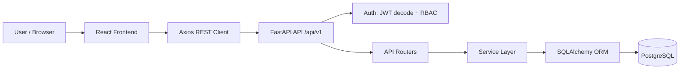
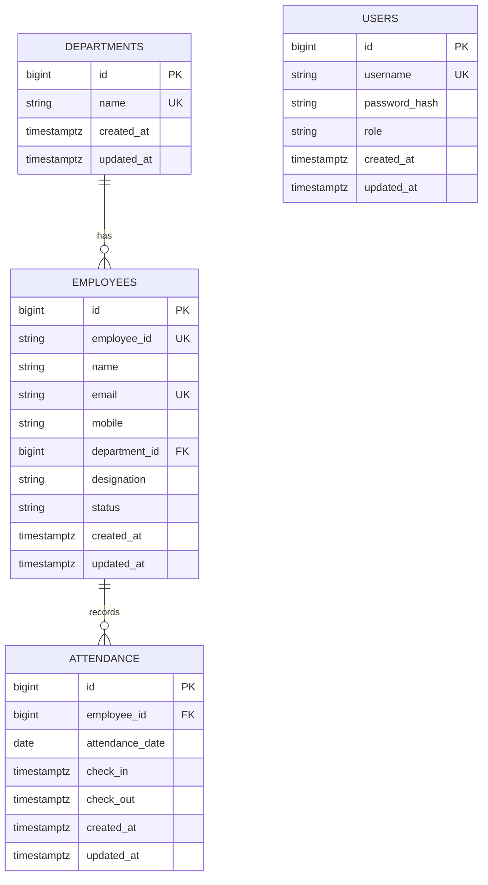

 
## 1. Project Overview
 
The Mini Attendance Management System is a full-stack web application for managing employee records and daily attendance within an organization. It lets HR/Admin staff authenticate, maintain an employee directory, record daily check-in/check-out attendance, and view operational metrics on a dashboard.
 
**Intended users:** Internal HR and Admin staff (no public-facing or self-service portal exists).
 
**Main capabilities implemented:**
- Username/password authentication with JWT-based session handling
- Employee CRUD (create, list/search/filter/sort/paginate, view, edit, logical deactivation)
- Attendance check-in / check-out with business-rule validation
- A daily/aggregate attendance view with computed PRESENT/ABSENT status
- An operational dashboard with employee and attendance counts
This is a **backend-driven modular monolith**: all business logic, validation, and computed status (e.g., PRESENT/ABSENT) live in the FastAPI backend. The React frontend is a thin presentation layer that calls the REST API.
 
---
 
## 2. Features
 
### Authentication
- Username/password login (`POST /api/v1/auth/login`) returning a signed JWT access token
- Passwords stored as bcrypt hashes; verified via `bcrypt.checkpw`
- JWT contains the user's internal ID (`sub`) and `role` claim, signed with `HS256` (configurable) and a configurable expiry
- All Employees, Attendance, and Dashboard endpoints require a valid Bearer token
- Role-based access control (RBAC) infrastructure is implemented via a `require_role(...)` FastAPI dependency
- Current user profile lookup (`GET /api/v1/auth/me`)
> **No public signup/registration endpoint exists.** There is no seed data in the repository either — see [Setup.txt](./Setup.txt) for how to provision the first user.
 
### Employee Management
- Add employee (`POST /api/v1/employees`), defaulting to `ACTIVE` status
- List employees with:
  - Case-insensitive search across `employee_id`, `name`, and `email`
  - Filter by `status` (ACTIVE/INACTIVE) and `department_id`
  - Pagination (`page`, `page_size`, max 100 per page)
  - Whitelisted sorting (`employee_id`, `name`, `created_at`; `asc`/`desc`)
- View employee details by internal ID (`GET /api/v1/employees/{id}`)
- Edit employee (`PUT /api/v1/employees/{id}`), with uniqueness re-validated on `employee_id` and email
- **Deactivate** employee (`DELETE /api/v1/employees/{id}`) — this is a **logical/soft deactivation** (`status` set to `INACTIVE`), not a physical row deletion
- View an employee's attendance history (`GET /api/v1/employees/{employee_id}/attendance`), resolvable by human-facing `employee_id` or internal PK, with date-range filtering and pagination
### Attendance Management
- Check-in (`POST /api/v1/attendance`, plus undocumented aliases `/attendance/check-in` and `/attendance/checkin`)
- Check-out by attendance record ID (`PUT /api/v1/attendance/{attendance_id}/checkout`)
- List/filter attendance records (by exact date, date range, employee, department) with pagination and whitelisted sorting
- Daily status summary with computed PRESENT/ABSENT counts (`GET /api/v1/attendance/daily-status`)
- Duplicate check-in/check-out prevention, inactive-employee blocking, timezone-aware validation, and future-timestamp rejection (see [Section 8](#8-attendance-business-rules))
### Dashboard
- Aggregated operational metrics (`GET /api/v1/dashboard`):
  - Total employees (ACTIVE + INACTIVE)
  - Active employees
  - Employees present today
  - Employees absent today
  - Department-wise employee distribution counts (all employees, including departments with zero employees)
- Optional `date` query parameter to compute metrics for a date other than today
---
 
## 3. Technology Stack
 
| Layer | Technology |
|---|---|
| Frontend | React 19 |
| Build Tool | Vite 8 |
| Routing | React Router 7 |
| Styling | Tailwind CSS 3 |
| HTTP Client | Axios 1 |
| Icons | lucide-react |
| Backend | FastAPI (`fastapi>=0.115.0`) |
| ASGI Server | Uvicorn |
| Validation | Pydantic v2 / Pydantic Settings |
| ORM | SQLAlchemy 2.0 |
| DB Driver | Psycopg 3 (`psycopg[binary]`) |
| Database | PostgreSQL 16 (Alpine image in Docker) |
| Migrations | Alembic |
| Authentication | PyJWT (HS256) + bcrypt |
| Testing | Pytest + HTTPX / FastAPI `TestClient` (SQLite in-memory for test isolation) |
| Containerization | Docker / Docker Compose (backend + PostgreSQL only) |
 
Versions above are taken directly from `frontend/package.json` and `backend/requirements.txt`; where a requirement uses a minimum-version pin (`>=`), the installed version may be newer.
 
---
 
## 4. System Architecture
 
The application is a modular monolith with a clear separation between routers (HTTP layer), services (business logic), schemas (validation/serialization), and models (persistence).
 
```
User
  │
  ▼
React Frontend (Vite dev server, :5173)
  │  Axios (Bearer token attached via interceptor)
  ▼
FastAPI REST API (:8000, prefix /api/v1)
  │
  ▼
Authentication / Authorization (JWT decode → get_current_user → require_role)
  │
  ▼
API Routers (auth, employees, attendance, dashboard)
  │
  ▼
Service Layer (business rules, timezone handling, validation)
  │
  ▼
SQLAlchemy ORM
  │
  ▼
PostgreSQL 16
```
 

 
The frontend and backend are **not** connected by an environment variable at present — the API base URL is hardcoded in the frontend Axios client (see [Section 11](#11-environment-variables)).
 
---
 
## 5. Project Structure
 
```
attendance-management-system-main/
├── backend/
│   ├── app/
│   │   ├── main.py              # FastAPI app, CORS, routers, /, /health
│   │   ├── core/
│   │   │   ├── config.py        # Pydantic Settings (env-driven)
│   │   │   ├── security.py      # bcrypt hashing, JWT create/decode
│   │   │   └── dependencies.py  # get_db, get_current_user, require_role
│   │   ├── db/
│   │   │   ├── database.py      # engine, SessionLocal, Base, TimestampMixin
│   │   │   └── models/          # user, department, employee, attendance
│   │   ├── schemas/              # Pydantic request/response models
│   │   ├── routers/              # auth, employees, attendance, dashboard
│   │   └── services/             # auth_service, employee_service,
│   │                              # attendance_service, dashboard_service
│   ├── alembic/                  # migration environment + versions/
│   ├── alembic.ini
│   ├── tests/                    # pytest suite (110 test functions)
│   ├── requirements.txt
│   ├── .env.example
│   └── Dockerfile
├── frontend/
│   ├── src/
│   │   ├── api/                  # client.js, auth.js, employees.js,
│   │   │                          # attendance.js, dashboard.js
│   │   ├── components/           # attendance/, dashboard/, employee/, shared
│   │   ├── context/AuthContext.jsx
│   │   ├── layouts/               # AppShell, Header, Sidebar
│   │   ├── pages/                 # LoginPage, DashboardPage, EmployeesPage,
│   │   │                          # AttendancePage
│   │   └── routes/                # AppRoutes, ProtectedRoute
│   ├── package.json
│   ├── vite.config.js
│   └── tailwind.config.js
└── docker-compose.yml             # backend + PostgreSQL services only
```
 
---
 
## 6. Authentication and Authorization
 
**Authentication** answers "who is the user?" **Authorization** answers "what is the user allowed to do?"
 
**Flow:**
1. User submits `username`/`password` to `POST /api/v1/auth/login`.
2. The backend looks up the user by username and verifies the password against its stored bcrypt hash (`verify_password`).
3. On success, the backend issues a JWT containing `sub` (the user's internal numeric ID, as a string) and `role`, signed with `JWT_SECRET_KEY` using the configured algorithm (default `HS256`), expiring after `JWT_ACCESS_TOKEN_EXPIRE_MINUTES`.
4. The frontend stores the token in `localStorage` (key `access_token`) and attaches it as `Authorization: Bearer <token>` on every subsequent Axios request via a request interceptor.
5. On each protected request, `get_current_user` decodes the JWT, loads the `User` row by `sub`, and raises `401` if the token is missing, expired, invalid, or the user no longer exists.
6. `require_role("ADMIN", "HR")` is applied at the **router level** for the Employees, Attendance, and Dashboard routers, so every endpoint in those routers requires the caller to hold one of the listed roles; a `403` is raised otherwise.
### Roles
 
Two roles exist at the database level (`CHECK (role IN ('ADMIN', 'HR'))`) and are included in the JWT payload. The `require_role` dependency is genuine, reusable RBAC infrastructure — but as currently wired, **every protected router lists `("ADMIN", "HR")` together**, so ADMIN and HR currently have **identical permissions** across the whole API. There is no endpoint today where an ADMIN can do something an HR user cannot, or vice versa. More granular per-role restrictions would need to be added to `require_role(...)` calls in the routers; see [Future Improvements](#16-future-improvements).
 
No JWT secrets, access tokens, or password hashes are reproduced anywhere in this documentation.
 
---
 
## 7. Database Design
 
**Engine:** PostgreSQL 16 (see [databaseScript.sql](./databaseScript.sql) for the full DDL).
 
### `users`
Stores application accounts (not employees). Columns: `id` (PK, bigint), `username` (unique), `password_hash`, `role` (`CHECK IN ('ADMIN','HR')`), `created_at`, `updated_at`.
 
### `departments`
Organizational divisions. Columns: `id` (PK), `name` (unique), `created_at`, `updated_at`.
 
### `employees`
Staff records. Columns: `id` (internal PK, bigint, auto-increment), `employee_id` (human-facing code, e.g. `EMP001`, unique — **renamed from `employee_code` in migration `002`**), `name`, `email` (unique case-insensitively via a functional index on `lower(email)`), `mobile` (optional), `department_id` (FK → `departments.id`, `ON DELETE RESTRICT`), `designation`, `status` (`CHECK IN ('ACTIVE','INACTIVE')`, defaults to `ACTIVE`), `created_at`, `updated_at`.
 
The distinction matters: **all internal relationships (e.g., attendance) reference `employees.id`, never the human-facing `employee_id`.** The `employee_id` string is a display/lookup convenience for end users and the attendance check-in payload; the backend resolves it to the internal PK before touching the `attendance` table.
 
### `attendance`
One row represents one clock-in/clock-out event for one employee on one date. Columns: `id` (PK), `employee_id` (FK → `employees.id`, `ON DELETE RESTRICT`), `attendance_date`, `check_in` (timestamp with time zone, required), `check_out` (timestamp with time zone, optional), `created_at`, `updated_at`.
 
- `UNIQUE (employee_id, attendance_date)` — prevents more than one attendance record per employee per day.
- `CHECK (check_out IS NULL OR check_out > check_in)` — enforced at the database level in addition to the service layer.
- Index on `attendance_date` to speed up daily/dashboard queries.
**There is no `status` column on `attendance`.** PRESENT/ABSENT is not stored; it is computed: a row's existence for an employee/date = PRESENT, and an ACTIVE employee with no row for that date = ABSENT. This design decision is documented directly in the SQLAlchemy model's docstring.
 
### ER Diagram
 

 
`USERS` is intentionally not connected to the other entities — it represents application login accounts, not employees.
 
---
 
## 8. Attendance Business Rules
 
All rules below are enforced in `attendance_service.py` (and, where noted, redundantly at the database level):
 
- **One attendance record per employee per day** — enforced by application-level lookup before insert *and* the `UNIQUE (employee_id, attendance_date)` database constraint (a duplicate insert that races past the app check is caught via `IntegrityError` and returned as `409 Conflict`).
- **Check-in required before check-out** — check-out (`/attendance/{attendance_id}/checkout`) operates on an existing attendance row; there is no way to check out without a prior check-in.
- **Check-out must be strictly after check-in** — validated in the service layer and enforced by the `CHECK (check_out IS NULL OR check_out > check_in)` constraint.
- **Future timestamps are rejected** — check-in and check-out timestamps more than 60 seconds ahead of the current time (Asia/Kolkata) are rejected with `400 Bad Request`; a 60-second tolerance accounts for minor clock skew between client and server.
- **Inactive employees cannot check in** — check-in is rejected with `400` if the resolved employee's `status` is not `ACTIVE`. (Historical attendance for already-inactive employees remains viewable via the history endpoint.)
- **Duplicate check-in** → `409 Conflict`. **Duplicate check-out** (already has a `check_out`) → `409 Conflict`.
- **Timezone:** the business timezone is `Asia/Kolkata` throughout. `check_in`/`check_out` must be timezone-aware; naive timestamps are rejected by both the Pydantic schema validators and the service layer. Server-computed defaults (when a timestamp is omitted) use the current time in `Asia/Kolkata`. "Today" for dashboard and daily-status defaults is also computed in `Asia/Kolkata`.
- **Present/Absent semantics:** the `attendance` table has **no status column**. An attendance row existing for an employee/date = `PRESENT`. An `ACTIVE` employee with no attendance row for the relevant date = `ABSENT`, computed dynamically at query time (`_list_with_absent` / dashboard queries). `INACTIVE` employees are excluded from present/absent counts even if they have historical attendance rows.
- **Attendance history** is available per employee (`GET /employees/{employee_id}/attendance`) with date-range filtering, pagination, and works for both ACTIVE and INACTIVE employees so history is preserved after deactivation.
- **No concurrency-specific handling** (e.g., row locking) beyond the database's unique constraint and standard `IntegrityError` handling was found; no `SELECT ... FOR UPDATE` or similar locking pattern is used.
- Statuses beyond `PRESENT`/`ABSENT` (e.g. `LATE`, `HALF_DAY`, `LEAVE`, `HOLIDAY`) **do not exist** in this implementation.
---
 
## 9. API Documentation
 
All endpoints are mounted under the `/api/v1` prefix (e.g., `/api/v1/auth/login`). Interactive documentation is available at `/docs` (Swagger UI) and `/redoc` (ReDoc) once the backend is running.
 
### Authentication
 
| Method | Path | Auth | Purpose |
|---|---|---|---|
| POST | `/api/v1/auth/login` | None | Authenticate with `{username, password}`; returns `{access_token, token_type}` |
| GET | `/api/v1/auth/me` | Bearer token | Returns the authenticated user's `id`, `username`, `role`, `created_at` |
 
### Employees
*(All endpoints require a valid Bearer token with role `ADMIN` or `HR`.)*
 
| Method | Path | Purpose | Notes |
|---|---|---|---|
| POST | `/api/v1/employees` | Create employee | Body: `employee_id, name, email, mobile?, department_id, designation`. Defaults `status=ACTIVE`. `409` on duplicate `employee_id`/email; `404` if department doesn't exist |
| GET | `/api/v1/employees` | List/search/filter/paginate | Query: `page, page_size(≤100), search, status, department_id, sort_by(employee_id|name|created_at), sort_order(asc|desc)` |
| GET | `/api/v1/employees/{employee_id}` | Get employee details | `{employee_id}` here is the **internal integer PK** |
| PUT | `/api/v1/employees/{employee_id}` | Edit employee | Body mirrors create + `status`. Re-validates uniqueness excluding self |
| DELETE | `/api/v1/employees/{employee_id}` | Deactivate employee | Soft delete: sets `status=INACTIVE`; row and history preserved |
| GET | `/api/v1/employees/{employee_id}/attendance` | Employee attendance history | `{employee_id}` here accepts the **human-facing code or internal PK**. Query: `page, page_size, start_date?, end_date?, sort_order` |
 
### Attendance
*(All endpoints require a valid Bearer token with role `ADMIN` or `HR`.)*
 
| Method | Path | Purpose | Notes |
|---|---|---|---|
| POST | `/api/v1/attendance` | Check-in | Body: `employee_id` (human-facing code), `attendance_date?`, `check_in?` (defaults to now/today in Asia/Kolkata). `400` on inactive employee/future timestamp; `409` on duplicate |
| POST | `/api/v1/attendance/check-in`, `/api/v1/attendance/checkin` | Check-in (aliases) | Undocumented in Swagger (`include_in_schema=False`); identical behavior to `POST /attendance` |
| PUT | `/api/v1/attendance/{attendance_id}/checkout` | Check-out | Uses the attendance record's internal PK. Optional body `{check_out}`; defaults to now. `404` if no record; `409` if already checked out; `400` if before check-in or in the future |
| GET | `/api/v1/attendance/daily-status` | Daily summary | Query: `attendance_date? (defaults today), department_id?, page, page_size`. Returns active-employee count, present/absent counts, and a paginated PRESENT/ABSENT list |
| GET | `/api/v1/attendance` | List/filter attendance | Query: `page, page_size, attendance_date?, start_date?, end_date?, employee_id?, department_id?, include_absent(bool), sort_by(attendance_date|check_in|check_out|created_at|employee_id), sort_order` |
 
### Dashboard
*(Requires Bearer token with role `ADMIN` or `HR`.)*
 
| Method | Path | Purpose | Notes |
|---|---|---|---|
| GET | `/api/v1/dashboard` | Aggregated metrics | Query: `date?` (aliases `target_date`, defaults to today in Asia/Kolkata). Returns `total_employees, active_employees, present_today, absent_today, department_counts[]` |
 
### General
 
| Method | Path | Auth | Purpose |
|---|---|---|---|
| GET | `/` | None | Welcome payload with links to `/docs` and `/health` |
| GET | `/health` | None | Health check, returns `{"status": "ok"}` |
 
There is no `/departments` listing endpoint in the backend — see [Issues/Uncertainties](#issues--uncertainties-cross-reference) below.
 
---
 
## 10. Frontend Routes
 
| Route | Access | Behavior |
|---|---|---|
| `/login` | Public | Login form; posts to `/auth/login`, stores token, redirects to `/dashboard` |
| `/dashboard` | Protected | Default landing page after login (`/` redirects here) |
| `/employees` | Protected | Employee list, search/filter/pagination, add/edit/deactivate modals |
| `/attendance` | Protected | Attendance list/filters, check-in/check-out modals, employee history modal |
| `*` (unmatched) | — | Redirects to `/dashboard` |
 
Protected routes are gated by `ProtectedRoute`, which redirects unauthenticated users to `/login` and shows a loading state while the session is being verified (`GET /auth/me` on mount, using the token in `localStorage`).
 
---
 
## 11. Environment Variables
 
### Backend (`backend/.env`, based on `backend/.env.example`)
 
```env
APP_NAME=Attendance Management System
ENVIRONMENT=development
 
DATABASE_URL=postgresql+psycopg://postgres:postgres@db:5432/attendance_db
 
JWT_SECRET_KEY=replace-with-a-secure-secret
JWT_ALGORITHM=HS256
JWT_ACCESS_TOKEN_EXPIRE_MINUTES=30
 
CORS_ORIGINS=http://localhost:5173
```
 
- `JWT_SECRET_KEY` has **no default** in code (`Settings.JWT_SECRET_KEY: str`, required) — the app will fail to start without it.
- `DATABASE_URL`'s default hostname is `db`, which resolves inside the Docker Compose network. When running the backend **outside** Docker (e.g., directly with Uvicorn) against a Dockerized Postgres, change the host to `localhost`.
- `CORS_ORIGINS` accepts a single origin or a comma-separated list.
### Frontend
 
**No `.env` file or `import.meta.env` usage exists in the frontend.** The API base URL is hardcoded in `frontend/src/api/client.js` as `http://localhost:8000/api/v1`. Changing the backend host/port requires editing this file directly.
 
No real secret values are included anywhere in this repository or in this documentation.
 
---
 
## 12. Docker
 
`docker-compose.yml` (repository root) defines exactly two services — **there is no frontend service in Docker Compose**:
 
- **`backend`** — built from `backend/Dockerfile` (Python 3.12-slim, installs `requirements.txt`, runs `uvicorn app.main:app --host 0.0.0.0 --port 8000`). Exposes port `8000:8000`. Depends on `db` being healthy. Reads `JWT_SECRET_KEY` from the host environment (`${JWT_SECRET_KEY}`) plus other settings hardcoded in the compose file.
- **`db`** — `postgres:16-alpine`, exposes `5432:5432`, credentials `postgres`/`postgres`, database `attendance_db`, with a `pg_isready` healthcheck (5s interval, 5 retries) and a named volume `postgres_data` for persistence.
The backend Dockerfile does **not** run Alembic migrations automatically — `alembic upgrade head` must be run manually (see [Setup.txt](./Setup.txt)). The backend container itself has no Docker `HEALTHCHECK` instruction (only `curl` is installed, presumably for manual/future use).
 
The frontend must be run separately with `npm run dev` (or built and served by other means); it is not containerized in this repository.
 
---
 
## 13. Testing
 
- **Framework:** Pytest, with FastAPI's `TestClient` (built on HTTPX) driving HTTP-level tests.
- **Location:** `backend/tests/` — `test_health.py`, `test_auth.py`, `test_employees.py`, `test_attendance.py`, `test_dashboard.py`, `test_models.py`.
- **Isolation:** tests do not touch the real PostgreSQL database. They use an in-memory SQLite engine (`sqlite:///:memory:`) with FastAPI's `app.dependency_overrides` swapping out `get_db` per test module, and a `conftest.py` compiler hook that maps `BigInteger` to SQLite's `INTEGER` for autoincrement PK compatibility.
- **Coverage areas confirmed by file:** health/security utilities, authentication and RBAC (`require_role`), employee CRUD/search/pagination/sorting, attendance check-in/check-out/business rules, dashboard metrics, and direct SQLAlchemy model/constraint behavior.
- **Test count:** 110 test functions across the 6 files above (counted directly from the source).
- **Run with:**
```bash
  cd backend
  pytest -v
```
 
No test count or coverage percentage beyond the function count above could be verified (no coverage tool/config such as `pytest-cov` or `.coveragerc` was found in `requirements.txt` or the repository).
 
---
 
## 14. Engineering Decisions
 
- **PostgreSQL with explicit constraints** (unique, check, foreign key) — business rules like "one attendance per employee per day" and "checkout after checkin" are enforced at the database level, not just in application code, guarding against race conditions and bugs in the service layer.
- **Separate internal PK vs. human-facing `employee_id`** — decouples the stable, immutable internal identity used for foreign keys from a human-editable business code, so `employee_id` can be corrected without cascading foreign-key churn.
- **Computed PRESENT/ABSENT rather than a stored status column** — avoids a class of data-integrity bugs where a stored status could drift out of sync with the actual existence of a check-in row; "presence" is a single source of truth (does a row exist?).
- **Soft employee deactivation** — preserves attendance history and referential integrity (`ON DELETE RESTRICT` on both `employees.department_id` and `attendance.employee_id`) rather than allowing destructive deletes that would orphan or delete historical attendance data.
- **Timezone-aware timestamps, fixed business timezone (Asia/Kolkata)** — avoids ambiguity between server/client timezones for a single-organization system where "today" needs one unambiguous definition.
- **Router/service/schema/model separation** — routers stay thin (HTTP concerns only), services hold business rules and can be unit-tested independent of HTTP, schemas validate/serialize input and output, models are pure persistence.
- **Whitelisted sort fields** (`SORTABLE_FIELDS` dictionaries in both `employee_service.py` and `attendance_service.py`) — prevents arbitrary column sorting from becoming a SQL-injection or information-disclosure vector.
- **JWT with role claim + reusable `require_role` dependency** — establishes real RBAC infrastructure even though role differentiation is not yet exploited beyond a single combined `("ADMIN","HR")` gate.
- **Pagination on all list endpoints** — keeps response payloads bounded (`page_size` capped at 100).
---
 
## 15. Security Considerations
 
- Passwords are never stored or transmitted in plain text; bcrypt (`bcrypt.hashpw`/`bcrypt.checkpw`) is used for hashing/verification.
- JWTs are signed (`HS256` by default) with a secret loaded from the environment (`JWT_SECRET_KEY`), never hardcoded, and required at startup (no fallback default).
- All Employees/Attendance/Dashboard endpoints are protected by Bearer-token authentication and role-based authorization (`require_role`).
- Input validation is enforced via Pydantic schemas (field length limits, email format regex, non-empty/whitespace checks, timezone-awareness checks on timestamps).
- Errors are translated to appropriate HTTP status codes (`400`, `401`, `403`, `404`, `409`) with descriptive (but not internals-leaking) messages; database `IntegrityError`s are caught and converted to `409 Conflict` rather than surfacing raw database errors.
- Sort and filter parameters are whitelisted against a fixed set of ORM columns, preventing arbitrary/unsafe ordering expressions.
- CORS origins are configured via environment variable rather than a wildcard, restricting which frontend origins may call the API with credentials.
---
 
## 16. Future Improvements
 
*(Explicitly not implemented today — listed only as possible future work.)*
 
- Refresh tokens / token revocation and a server-side logout endpoint (logout is currently client-side only, clearing `localStorage`)
- More granular RBAC (distinct ADMIN-only vs. HR-only permissions)
- Self-service admin user management / registration endpoints (currently there is no way to create a user account except by inserting directly into the database)
- A `/departments` API so the frontend department list is no longer hardcoded
- Attendance percentage / analytics reporting
- CSV/Excel export of employee or attendance data
- Live production deployment configuration and CI/CD pipeline
- A Postman collection (Swagger/`/docs` currently serves as the only interactive API reference)
- Broader automated test coverage tooling (e.g., coverage reporting)
- Audit logging of administrative actions
- Environment-variable-driven API base URL on the frontend (currently hardcoded)
---
 
## 17. Assessment Notes
 
This project demonstrates: a layered FastAPI backend (routers/services/schemas/models) with database-enforced business rules, JWT authentication with a genuine (if not yet fully exploited) RBAC dependency, Alembic-managed schema evolution (including a real column-rename migration), timezone-correct business logic for a single-timezone organization, a computed-rather-than-stored attendance status design, and a React/Vite frontend consuming that API through a centralized Axios client with token-based session handling. Automated tests exercise the API end-to-end against an isolated in-memory database rather than mocks.
 
---
 
 


